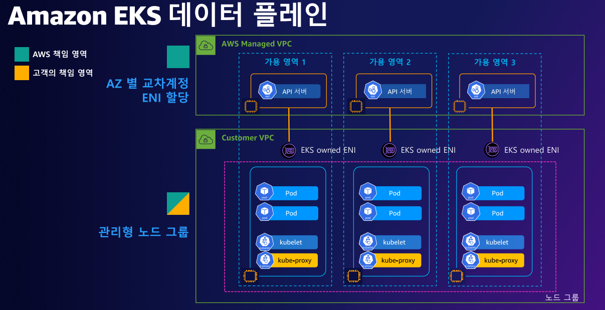

# EKS with Terraform

EKS IAC

스터디에서 사용할 EKS 코드를 IaC 인 Terraform으로 생성하는 과정입니다.

## EKS

](images/image.png)

[https://awskoreamarketingasset.s3.amazonaws.com/2022 Summit/pdf/T14S4_Amazon EKS 마이그레이션 요점 정리.pdf](https://awskoreamarketingasset.s3.amazonaws.com/2022%20Summit/pdf/T14S4_Amazon%20EKS%20%EB%A7%88%EC%9D%B4%EA%B7%B8%EB%A0%88%EC%9D%B4%EC%85%98%20%EC%9A%94%EC%A0%90%20%EC%A0%95%EB%A6%AC.pdf)



**Amazon EKS(Amazon Elastic Kubernetes Service)** 는 완전관리형 Kubernetes 서비스입니다.

- **AWS 관리형 컨트롤 플레인**:
    - EKS는 Kubernetes의 핵심 구성요소(ETCD, API 서버 등)를 AWS가 완전 관리
    - 장애 발생 시 자동 복구 & 가용성
    - AWS 서비스(ALB, IAM, CloudWatch 등)와의 통합으로 AWS 생태계 활용
- **통합 AWS 생태계**:
    - AWS IAM과 연동하여 권한 제어
    - 자동 확장(Auto Scaling)이나 로드밸런서(ALB/NLB) 등 연계
    - AWS의 스토리지와 네트워크 통합
- **IRSA(IAM Roles for Service Accounts)** 등 컨테이너 워크로드에 대한 세분화된 권한 설정
    - 클라우드 리소스별 세부 권한 분리

## Terraform

**Terraform** 은 IaC(Infrastructure as Code)의 표준 도구

- **상태 관리(State Management)**
    - Terraform은 state 파일을 통해 인프라 상태를 저장, 필요한 변경만 수행
    - 상태 파일은 협업 시에도 유용하며, 인프라의 최신 상태를 추적 가능
- **복원력**
    - Terraform은 선언적 구성을 사용하여 원하는 최종 상태를 정의
        - 상태를 달성하기 위해 필요한 조치를 자동으로 계산
    - 배포 실패 시 롤백을 용이
- **자동화된 인프라 생성**
    - 선언형 코드로 원하는 인프라 상태를 정의해 리소스를 생성/연결/삭제
    - 모든 변경 사항은 명확하게 정의되어 반복 가능한 환경을 제공

## Terraform Provisioning & Deletion

### Terraform Code

```jsx
# 코드 가져오기
git clone https://github.com/idoyo7/DKS.git
cd terraform

# terraform 환경 변수 저장
export TF_VAR_KeyName=[각자 ssh keypair]
echo $TF_VAR_KeyName

# 배포 정보 확인하기
terraform init
terraform plan

# 10분 후 배포 완료
terraform apply -auto-approve
```

### 배포된 테라폼 정보 확인

```jsx
# State 파일 확인
**terraform state list
~~~**
# 배포된 정보 확인
**terraform console**
-----------------
data.aws_caller_identity.current
**data.aws_caller_identity.current.arn**
data.aws_eks_cluster.cluster
**data.aws_eks_cluster.cluster.name**
**data.aws_eks_cluster.cluster.version
data.aws_eks_cluster.cluster.access_config**
data.aws_eks_cluster_auth.cluster
kubernetes_service_account.aws_lb_controller
-----------------
terraform state show ...

# 자세한 정보들
cat terraform.tfstate | jq 
**more terraform.tfstate**
```

### Verify

```jsx
kubectl get node -v=6

# EKS 클러스터 인증 정보 업데이트
CLUSTER_NAME=myeks
aws eks update-kubeconfig --region ap-northeast-2 --name $CLUSTER_NAME
kubectl config rename-context "arn:aws:eks:ap-northeast-2:$(aws sts get-caller-identity --query 'Account' --output text):cluster/$CLUSTER_NAME" "DKS-Labs"

# config 내용 확인
kubectl cluster-info
kubectl get node --label-columns=node.kubernetes.io/instance-type,eks.amazonaws.com/capacityType,topology.kubernetes.io/zone
kubectl get pod -A
```

### AWS LB Controller

EKS의  AWS Elastic Load Balancer를 관리 

컨트롤러는 클러스터 Service 또는 Ingress 정보의  AWS 로드 밸런서를 프로비저닝

컨트롤러는 클러스터의 여러 포드를 가리키는 단일 IP 주소 또는 DNS 이름을 생성합니다.

](images/image2.png)

[https://docs.aws.amazon.com/ko_kr/eks/latest/userguide/aws-load-balancer-controller.html](https://docs.aws.amazon.com/ko_kr/eks/latest/userguide/aws-load-balancer-controller.html)

2.5 버전 이상에서는 AWS Load Balancer Controller이(가) **`type: LoadBalancer`**와(과) 함께 Kubernetes 서비스 리소스의 기본 컨트롤러가 되며 각 서비스에 대한 AWS Network Load Balancer(NLB)를 만듭니다.

Kubernetes **`Ingress`**

Kubernetes **`Ingress`**을(를) 생성할 때 AWS Load Balancer Controller은(는) AWS Application Load Balancer(ALB)를 생성합니다.

**AWS LoadBalancer의 동작방식**


[https://kubernetes-sigs.github.io/aws-load-balancer-controller/v2.6/how-it-works/](https://kubernetes-sigs.github.io/aws-load-balancer-controller/v2.6/how-it-works/)

- AWS LB는 인스턴스 모드와 IP모드를 지원합니다.
- K8s의 경우 한 인스턴스(노드)에 여러 POD가 있을수 있겠죠.
- 인티스턴스모드의 경우 해당 노드로 트래픽이 도달 후 다시 POD를 찾아서 전달하는 방식으로 이를 위해서는 NodePort를 활용하며, LB에는 노드의 대표 IP가 등록됩니다.
- IP모드의 경우 노드의 대표 IP를 거치지 않고, 바로 Pod의 IP로 트래픽을 전달하며, 따라서 Pod IP가 직접 LB에 등록됩니다.

```bash
ACCOUNT_ID=$(aws sts get-caller-identity --query 'Account' --output text)
CLUSTER_NAME=myeks

eksctl create iamserviceaccount --cluster=$CLUSTER_NAME --namespace=kube-system --name=aws-load-balancer-controller --role-name AmazonEKSLoadBalancerControllerRole \
--attach-policy-arn=arn:aws:iam::$ACCOUNT_ID:policy/AWSLoadBalancerControllerIAMPolicy --override-existing-serviceaccounts --approve

helm upgrade --install aws-load-balancer-controller eks/aws-load-balancer-controller -n kube-system --set clusterName=$CLUSTER_NAME \
  --set serviceAccount.create=false --set serviceAccount.name=aws-load-balancer-controller

```

### External DNS

ExternalDNS는 Kubernetes 의 서비스와 도메인(DNS) 이름을 자동으로 연결해주는 도구

- Kubernetes 리소스(예: Ingress, Service)를 기반으로 DNS 레코드를 생성, 업데이트, 삭제하는 작업을 자동화합니다.
- Route53, Cloudflare, Azure DNS 등 여러 클라우드 DNS 제공자와 통합됩니다.

**ExternalDNS의 주요 동작 원리**

1. Kubernetes 리소스(예: Ingress, Service)를 감시하여 DNS 이름 및 대상 IP를 확인합니다.
2. Kubernetes 리소스와 연결된 DNS 제공자(Route53 등)에 DNS 레코드를 생성하거나 업데이트합니다.
3. DNS 레코드가 Kubernetes 리소스의 상태에 맞춰 자동으로 관리됩니다.
4. 삭제된 리소스는 관련된 DNS 레코드도 제거하여 불필요한 리소스를 최소화합니다.
5. 

**ExternalDNS 설치**

```bash
# EKS 배포 시 Node IAM Role 설정되어 있음
# eksctl create cluster ... --external-dns-access ...

# 
MyDomain=montkim.org
# 자신의 Route 53 도메인 ID 조회 및 변수 지정
MyDnzHostedZoneId=$(aws route53 list-hosted-zones-by-name --dns-name "${MyDomain}." --query "HostedZones[0].Id" --output text)

# 변수 확인
echo $MyDomain, $MyDnzHostedZoneId

# ExternalDNS 배포
curl -s -O https://raw.githubusercontent.com/gasida/PKOS/main/aews/externaldns.yaml
sed -i '' "s/0.13.4/0.14.0/g" externaldns.yaml

cat externaldns.yaml | yh
MyDomain=$MyDomain MyDnzHostedZoneId=$MyDnzHostedZoneId envsubst < externaldns.yaml | kubectl apply -f -

```

- external dns with helm
    
    ```bash
    # EKS 배포 시 Node IAM Role 설정되어 있음
    # eksctl create cluster ... --external-dns-access ...
    DOMAIN="montkim.org"
    AWS_REGION="ap-northeast-2"
    HOSTED_ZONE_ID=$(aws route53 list-hosted-zones-by-name \
      --dns-name "${DOMAIN}." \
      --query "HostedZones[0].Id" \
      --output text)
    
    helm upgrade --install external-dns bitnami/external-dns \
      --namespace kube-system \
      --create-namespace \
      --set "provider=aws" \
      --set "aws.zoneType=public" \
      --set "txtOwnerId=externaldns-${HOSTED_ZONE_ID}" \
      --set "domainFilters[0]=$DOMAIN" \
      --set "aws.region=$AWS_REGION" \
      --set "rbac.create=true" \
      --set "serviceAccount.create=true" \
      --set "serviceAccount.name=external-dns"
    ```
    

## 클러스터 삭제

생성의 역순인 삭제를 해주도록 하겠습니다

```jsx
terraform destroy -auto-approve
```