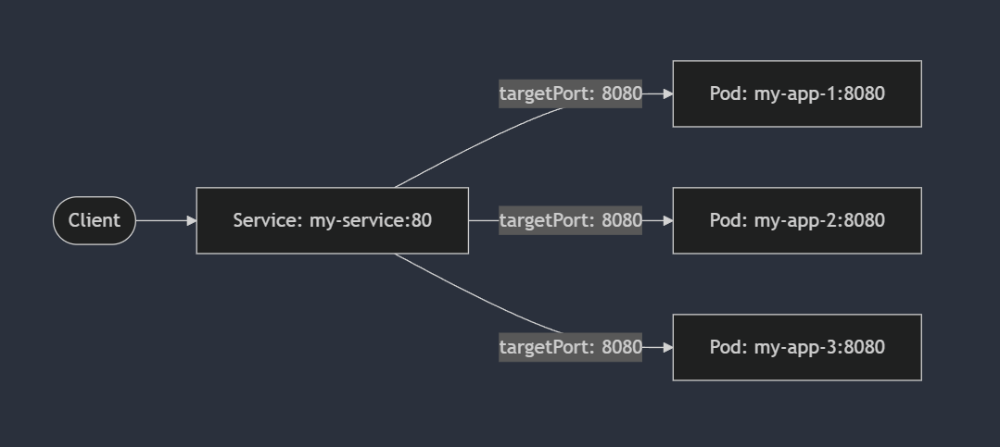
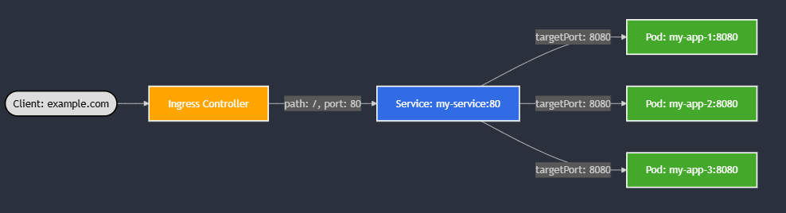
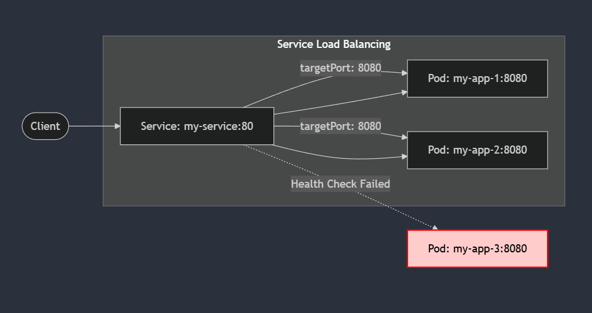

# 쿠버네티스 기본 리소스

기본 리소스를 체계적으로 이해하고 실습할 수 있도록 **컨테이너 -> 파드 -> 워크로드 -> 네트워킹**으로 이어지는 구조를 제안합니다.

---

# **Kubernetes 기본 리소스 계층**

### **Container**

- 쿠버네티스에서 실행되는 애플리케이션의 가장 작은 단위.
- 컨테이너 이미지를 기반으로 실행되며, 쿠버네티스가 관리.

```bash
# Dockerfile 예시
FROM nginx:alpine
COPY index.html /usr/share/nginx/html
EXPOSE 80
CMD ["nginx", "-g", "daemon off;"]

```

- 주요 개념:
    - **환경변수(Env Vars)**:
        - 쿠버네티스 스펙 내 `env` 또는 `envFrom`(ConfigMap, Secret 사용).
    - **Command & Args**:
        - `spec.containers.command`와 `spec.containers.args`로 command/argument 오버라이드 가능.
    - **Security Context**:
        - 컨테이너, 파드 레벨에서의 보안 설정(읽기 전용 파일시스템, runAsUser 등).

### **Pod (파드)**

- 컨테이너를 묶는 기본 단위.
- 하나의 파드는 **여러 컨테이너**를 포함할 수 있으며, 주로 단일 컨테이너로 구성.
- 주요 개념:
    - Multi-Container Pods:
        - Init Container: 메인 컨테이너 실행 전 사전 작업(예: config 파일 생성, DB schema init).
        - Sidecar Pattern: 로그 수집, 프록시, 모니터링 에이전트 등 보조 역할.
    - Volume:
        - EmptyDir, HostPath, ConfigMap, Secret, PVC 등 다양한 볼륨 타입.
        - ConfigMap/Secret 통해 env 주입.
    - Resource Requests & Limits 를 통한 자원 설정.
    - Liveness/Readiness Probe 를 이용한 HealthCheck

### **ReplicaSet**

- 파드 복제를 통해 안정적인 애플리케이션 가용성을 보장.
- 일반적으로 Deployment, DaemonSet, StatefulSet과 같은 상위 워크로드 리소스가 관리.

## **Workload 리소스**

### **Deployment**

- 무상태(stateless) 애플리케이션에 적합.
- **RollingUpdate** 전략: 무중단 배포 (배포 시점에 새로운 파드와 기존 파드를 동시에 운영).
- **Recreate** 전략: 기존 파드를 모두 중지 후 새 파드 배포.

### **DaemonSet**

- 모든 노드(또는 특정 레이블의 노드)마다 1개씩 파드 배포.
- 로그 수집, 모니터링, 네트워킹 에이전트 등 시스템 레벨 데몬에 적합.

### **StatefulSet**

- 상태가 필요한 애플리케이션(데이터베이스, Zookeeper 등) 관리.
- 각 파드에 고유한 ID(이름 및 순서)가 부여.
- **PersistentVolumeClaim**과 연동하여 스토리지 영속성 보장.

주요 차이점:

| **항목** | **Deployment** | **DaemonSet** | **StatefulSet** |
| --- | --- | --- | --- |
| **사용 사례** | 일반 애플리케이션 (무상태) | 노드별 에이전트 배포 | 상태 있는 데이터베이스 등 |
| **복제 방식** | 원하는 개수만큼 복제 | 모든 노드에 1개씩 배포 | 이름/순서를 가진 복제본 관리 |
| **스토리지** | Stateless | Stateless | 상태 저장 (PersistentVolume) |

---

## **데이터 관리 리소스**

### **ConfigMap**

- 비민감한 설정 데이터를 저장.
- 환경 변수, 설정 파일, CLI 인자로 주입 가능.

### **Secret**

- 민감한 데이터를 저장. (예: 비밀번호, API 키)
- Base64로 인코딩되어 저장되며, 추가 암호화 가능.

### **ConfigMap과 Secret의 차이점**

| **항목** | **ConfigMap** | **Secret** |
| --- | --- | --- |
| **목적** | 비민감한 설정 데이터를 저장. | 민감한 데이터를 저장 (예: 비밀번호, 인증 토큰). |
| **보안** | 평문으로 저장. | Base64로 인코딩되어 저장.이외에도 Kubernetes는 Secret 데이터를 etcd에 **암호화**할 수 있는 옵션 제공. |
| **기본 용량 제한** | 약 1MB. | 약 1MB. (ConfigMap과 동일) |
| **데이터 접근** | 컨테이너 환경변수, 볼륨 마운트, Command-line 등. | ConfigMap과 동일하지만 **보안 고려** 필요. |
| **External Integration** | 보통 외부 시스템과의 연계가 필요하지 않음. | 외부 비밀 관리 시스템(예: AWS Secrets Manager, HashiCorp Vault)과 연계. |
| **주요 사용 사례** | - 환경 변수
- 구성 파일
- 스크립트 등. | - 비밀번호
- API 키
- 인증서
- OAuth 토큰 등. |

---

### **Secret의 주요 특징**

1. **Base64 인코딩**:
    - Kubernetes 내부에서 Secret은 Base64로 인코딩됩니다. 하지만 이는 단순히 데이터 전송의 편의를 위해 인코딩된 것이지, 암호화된 데이터는 아닙니다.
    - 추가적인 보안이 필요한 경우 **etcd 암호화**를 활성화해야 합니다.
2. **etcd와 Secret 암호화**:
    - 기본적으로 Secret은 etcd에 평문으로 저장되기 때문에, 데이터 유출 위험이 있습니다.
    - Kubernetes에서는 `-encryption-provider-config`를 통해 etcd에 저장되는 Secret을 암호화할 수 있습니다.
3. **RBAC (Role-Based Access Control)**:
    - Secret은 ConfigMap보다 민감한 데이터를 다루기 때문에 **RBAC**으로 접근 제어가 필수적입니다.
    - 예를 들어, 특정 네임스페이스에만 접근을 허용하거나, 읽기/쓰기 권한을 제한할 수 있습니다.
4. **외부 Secret 관리**:
    - Secret은 종종 외부 시스템과 연동하여 관리됩니다. Kubernetes에 저장된 Secret이 아닌, **외부 Secret Management 도구**와 통합하여 사용하는 경우가 많습니다.
    - 예: AWS Secrets Manager, HashiCorp Vault, Azure Key Vault.
- **PersistentVolume (PV) / PersistentVolumeClaim (PVC)**
    - 상태 저장 애플리케이션을 위한 외부 스토리지 연계.
    - 동적/정적 프로비저닝 개념.

---

## **네트워킹 리소스**

### **Service (SVC)**

- 파드 간의 통신을 위해 안정적인 IP와 DNS 이름 제공.
- **Service Discovery**: `svc-name.namespace.svc.cluster.local` 형태로 DNS가 자동 생성.
- 주요 Service 타입:
    - **ClusterIP**: 클러스터 내부에서만 접근.
    - **NodePort**: 외부에서 고정 포트를 통해 접근 가능.
    - **LoadBalancer**: 클라우드에서 외부 로드밸런서를 생성.



- 예:
    
    ```yaml
    apiVersion: v1
    kind: Service
    metadata:
      name: my-service
    spec:
      selector:
        app: my-app
      ports:
        - protocol: TCP
          port: 80
          targetPort: 8080
      type: ClusterIP
    ```
    

### **Ingress**

- HTTP/HTTPS 요청을 특정 Service로 라우팅.
- 주요 기능:
    - 경로 기반 라우팅 (Path-Based Routing).
    - 도메인 기반 라우팅 (Host-Based Routing).
    - TLS 인증서로 HTTPS 제공.



- 예:
    
    ```yaml
    apiVersion: networking.k8s.io/v1
    kind: Ingress
    metadata:
      name: example-ingress
    spec:
      rules:
        - host: example.com
          http:
            paths:
              - path: /
                pathType: Prefix
                backend:
                  service:
                    name: my-service
                    port:
                      number: 80
    ```
    

---

### **YAML 문법과 kubectl 명령어**

- YAML 문법:
    - 기본 구조: `apiVersion`, `kind`, `metadata`, `spec` 필드.
    - 들여쓰기, 리스트, 맵 형식.
    - 자주 사용하는 필드와 키워드 설명.
- kubectl 명령어:
    - 리소스 생성:
    
    ```bash
    kubectl apply -f
    ```
    
    - 리소스 조회:
    
    ```bash
    kubectl get <resource>
    ```
    
    - 리소스 세부 정보:
    
    ```bash
    kubectl describe <resource>
    ```
    
    - 로그 확인:
    
    ```bash
    kubectl logs <pod>
    ```
    
    - 파드 내부 접근:
    
    ```bash
    kubectl exec -it <pod> -- /bin/bash
    ```
    

---

### **실습: 간단한 애플리케이션 배포**

### **1) Deployment 생성**

- 애플리케이션을 배포하고 ReplicaSet으로 관리.

```yaml
apiVersion: apps/v1
kind: Deployment
metadata:
  name: mario
  namespace: games
  labels:
    app: mario
spec:
  replicas: 1
  selector:
    matchLabels:
      app: mario
  template:
    metadata:
      labels:
        app: mario
    spec:
      containers:
      - name: mario
        image: pengbai/docker-supermario

```

### **2) Service로 노출**

- ClusterIP로 파드에 접근.

```yaml
apiVersion: v1
kind: Service
metadata:
   name: mario
   namespace: games
   annotations:
     alb.ingress.kubernetes.io/healthcheck-path: /mario/index.html
spec:
  selector:
    app: mario
  ports:
  - port: 80
    protocol: TCP
    targetPort: 8080
  type: NodePort
  externalTrafficPolicy: Local

```

### **3) Ingress를 통해 외부로 노출**

- HTTP 경로를 통해 접근 설정.

```yaml
apiVersion: networking.k8s.io/v1
kind: Ingress
metadata:
  namespace: games
  name: games-ingress
  annotations:
    alb.ingress.kubernetes.io/scheme: internet-facing
    alb.ingress.kubernetes.io/target-type: ip
    alb.ingress.kubernetes.io/certificate-arn: ${CERT_ARN}
    alb.ingress.kubernetes.io/listen-ports: '[{"HTTP": 80}, {"HTTPS": 443}]'
    alb.ingress.kubernetes.io/healthcheck-protocol: HTTP
    alb.ingress.kubernetes.io/healthcheck-port: traffic-port
    alb.ingress.kubernetes.io/healthcheck-interval-seconds: '15'
    alb.ingress.kubernetes.io/healthcheck-timeout-seconds: '5'
    alb.ingress.kubernetes.io/success-codes: '200'
    alb.ingress.kubernetes.io/healthy-threshold-count: '2'
    alb.ingress.kubernetes.io/unhealthy-threshold-count: '2'
spec:
  ingressClassName: alb
  rules:
    - host: ${WEBDOMAIN}
      http:
        paths:
        - path: /
          pathType: Prefix
          backend:
            service:
              name: mario
              port:
                number: 80

```

배포하기

```bash

kubectl create namespace games

# 애플리케이션 배포
kubectl apply -f mario.yaml

```

ingress 설정

```bash
DOMAIN="montkim.org"
WILDCARD_DOMAIN="*.$DOMAIN"

CERT_ARN=$(aws acm list-certificates --output json | jq -r --arg wildcard "$WILDCARD_DOMAIN" '.CertificateSummaryList[] | select(.DomainName==$wildcard) | .CertificateArn')

WEBDOMAIN=mario.montkim.org
WEBDOMAIN=$WEBDOMAIN CERT_ARN=$CERT_ARN envsubst < ingress.yaml > rendered-ingress.yaml
kubectl apply -f rendered-ingress.yaml
```

- onpremise / ingress nginx controller 용 설정
    
    ```bash
    apiVersion: apps/v1
    kind: Deployment
    metadata:
      name: mario
      namespace: games
      labels:
        app: mario
    spec:
      replicas: 1
      selector:
        matchLabels:
          app: mario
      template:
        metadata:
          labels:
            app: mario
        spec:
          containers:
          - name: mario
            image: pengbai/docker-supermario
    ---
    apiVersion: v1
    kind: Service
    metadata:
       name: mario
       namespace: games
    spec:
      selector:
        app: mario
      ports:
      - port: 80
        protocol: TCP
        targetPort: 8080
      type: NodePort
    ---
      apiVersion: networking.k8s.io/v1
      kind: Ingress
      metadata:
        namespace: games
        name: games-ingress
      spec:
        ingressClassName: nginx
        rules:
          - host: mario.montkim.com
            http:
              paths:
              - path: /
                pathType: Prefix
                backend:
                  service:
                    name: mario
                    port:
                      number: 80
    ```
    

---

## **Advanced**



- **Probes**: Liveness, Readiness 설정.
- **Horizontal Pod Autoscaler (HPA)**: 부하에 따른 자동 확장.
- **Node Affinity/Taints & Tolerations**: 노드 스케줄링 제약.
- 

## **Probes**

Probes는 Kubernetes에서 Pod 상태를 모니터링하는 메커니즘으로, 두 가지 주요 유형이 있습니다.

### **Liveness Probe**

- Pod이 **죽었는지**를 판단합니다.
- 실패 시 컨테이너를 재시작합니다.
- 예를 들어, 애플리케이션이 Deadlock 상태가 되면 이를 감지하고 복구합니다.

### **Readiness Probe**

- Pod이 **트래픽을 받을 준비가 되었는지**를 판단합니다.
- 실패 시 Pod을 Service의 엔드포인트에서 제거합니다.
- 애플리케이션이 초기화 중이거나 외부 종속성을 대기하는 경우 유용합니다.

### **Startup Probe**

- 애플리케이션이 시작되었는지 확인합니다.
- 실패 시 Pod을 재시작하며, 초기화가 느린 애플리케이션에 적합합니다.

### **Probes 설정 예제**

```yaml
apiVersion: apps/v1
kind: Deployment
metadata:
  name: nginx-probe-example
spec:
  replicas: 1
  selector:
    matchLabels:
      app: nginx
  template:
    metadata:
      labels:
        app: nginx
    spec:
      containers:
        - name: nginx
          image: nginx:latest
          ports:
            - containerPort: 80
          livenessProbe:
            httpGet:
              path: /
              port: 80
            initialDelaySeconds: 3
            periodSeconds: 5
          readinessProbe:
            httpGet:
              path: /
              port: 80
            initialDelaySeconds: 3
            periodSeconds: 5
          startupProbe:
            httpGet:
              path: /
              port: 80
            initialDelaySeconds: 5
            periodSeconds: 10

```

---

## **Horizontal Pod Autoscaler (HPA)**

HPA는 애플리케이션 부하에 따라 Pod의 개수를 자동으로 조정합니다. CPU 사용량, 메모리 사용량, 또는 커스텀 메트릭을 기준으로 동작합니다.

### **HPA의 주요 개념**

- **기준 메트릭**: 기본적으로 CPU, 메모리 사용량을 기준으로 설정.
- **자동 확장**: 사용량이 높아지면 Pod 수를 늘리고, 낮아지면 줄임.
- **리소스 요청/제한 필요**: Pod의 CPU/메모리 요청 값(`resources.requests`)이 설정되어야 효과적으로 동작.

### **HPA 설정 예제**

```yaml
apiVersion: autoscaling/v2
kind: HorizontalPodAutoscaler
metadata:
  name: nginx-hpa
spec:
  scaleTargetRef:
    apiVersion: apps/v1
    kind: Deployment
    name: nginx-deployment
  minReplicas: 1
  maxReplicas: 5
  metrics:
    - type: Resource
      resource:
        name: cpu
        target:
          type: Utilization
          averageUtilization: 50

```

### **HPA 작동 원리**

1. CPU 사용량이 50%를 초과하면 Pod 수를 늘립니다.
2. 사용량이 50% 이하로 감소하면 Pod 수를 줄입니다.
3. Kubernetes Metrics Server가 활성화되어 있어야 작동합니다.

---

## **Node Affinity / Taints & Tolerations**

Pod을 특정 노드에 배치하거나 특정 노드를 회피하도록 설정합니다.

### **Node Affinity**

- 특정 조건의 노드에만 Pod을 배치합니다.
- **Types**:
    - `requiredDuringSchedulingIgnoredDuringExecution`: 강제 배치.
    - `preferredDuringSchedulingIgnoredDuringExecution`: 선호 배치.

### **Node Affinity 예제**

```yaml
apiVersion: apps/v1
kind: Deployment
metadata:
  name: nginx-affinity
spec:
  replicas: 1
  selector:
    matchLabels:
      app: nginx
  template:
    metadata:
      labels:
        app: nginx
    spec:
      affinity:
        nodeAffinity:
          requiredDuringSchedulingIgnoredDuringExecution:
            nodeSelectorTerms:
              - matchExpressions:
                  - key: disktype
                    operator: In
                    values:
                      - ssd
      containers:
        - name: nginx
          image: nginx:latest

```

### **Taints & Tolerations**

- **Taints**: 노드에 태그를 추가하여 특정 Pod만 실행되도록 제한합니다.
- **Tolerations**: Pod이 Taints를 무시하고 해당 노드에 배치되도록 설정합니다.

### **Taints 설정 예제**

```bash
kubectl taint nodes <node-name> disktype=ssd:NoSchedule
```

### **Tolerations 설정 예제**

```yaml
apiVersion: apps/v1
kind: Deployment
metadata:
  name: nginx-toleration
spec:
  replicas: 1
  selector:
    matchLabels:
      app: nginx
  template:
    metadata:
      labels:
        app: nginx
    spec:
      tolerations:
        - key: "disktype"
          operator: "Equal"
          value: "ssd"
          effect: "NoSchedule"
      containers:
        - name: nginx
          image: nginx:latest

```