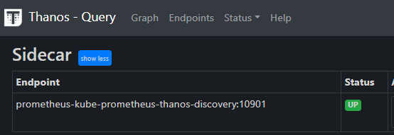
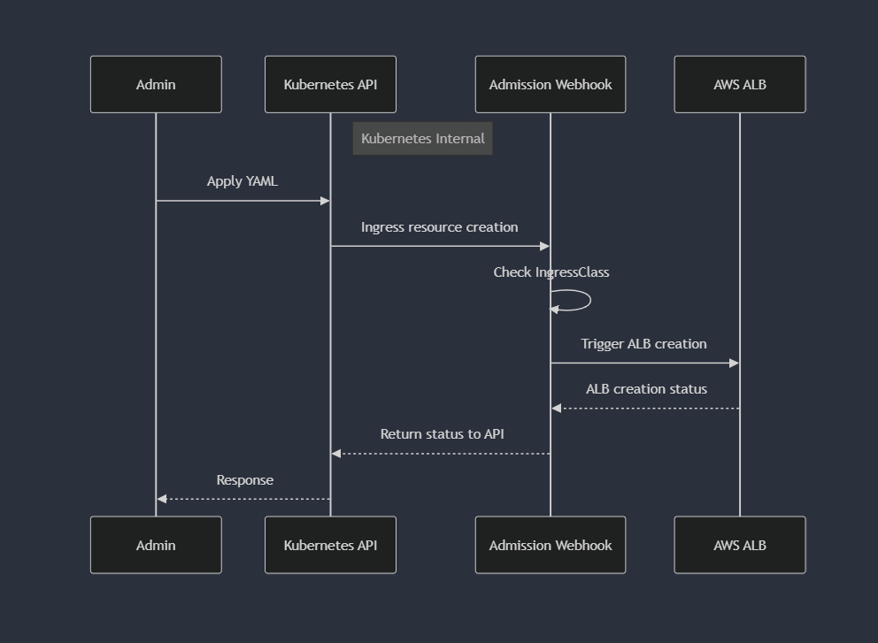

### 네트워크

  

컨테이너 네트워크 인터페이스(CNI, Container Network Interface)는 컨테이너의 네트워크를 설정하고 관리하기 위한 표준입니다. CNI는 컨테이너 오케스트레이션 시스템(예: Kubernetes)과 다양한 네트워크 구현체 간의 인터페이스를 제공하여, 컨테이너가 네트워크에 연결될 수 있도록 합니다.

  

사실 컨테이너 표준이 제정되면서, 네트워크의 표준인

  

Container Networking Interface 규격을 만족시키는경우 컨테이너간 네트워크를 광범위하게 활용할수있 방향으로 이어져갔습니다.

  

https://github.com/containernetworking/cni

  

## 서비스

  

쿠버네티스 POD을 내부/외부로 통신하기위해서 서비스라는 컴포넌트가 존재합니다.

  

서비스는 ClusterIP, NodePort, LoadBalancer 가 있습니다.

  


  

전에 간략하게 이야기했던, Probe같은 헬스체크들을 통해서 로드밸런싱 대상들을 특정 할 수 있습니다.

  


  

### ClusterIP

  


  

ClusterIP는 service를 통해 내부 endpoint로 부하분산을 해줍니다.
외부노출은 없지만 core-dns 등을 통한 내부통신을 위한 서비스이거나,



이런 내부 dns 구성을 통해 외부노출 없는 어플리케이션 간 dns 기반의 연결도 가능합니다.

ingress controller같은 서비스를 통해 외부 노출이 가능합니다.


여기선 ingress controller만 어떻게든 외부노출이 되어있다면, 해당 규칙을 통해서 내부적으로 선언된 svc들을 ingress controller에 연결하여 배포한 파드들을 정해진 규칙으로 (ingress에 선언한) 외부로 노출 할 수 있습니다.

아마도, Service 라는 컴포넌트가 ECS같은 컨테이너 자체를 실행만 하는것 이상으로, 쿠버네티스라는 플랫폼 내부적으로 컨테이너들을 더 잘 묶을수 있는 단위라고 생각합니다.

꼭 Public 하게 오픈이 되어있지 않아도 Internal LB를 만드는것과 동일한 기능을 플랫폼에서 처리해주는 기능이라고 생각하시면 될것같습니다.


### NodePort


  
NodePort는 pod가 할당되어있는 node의 특정 포트를 open하여 외부로 통신이 가능하게 하는 서비스 타입입니다.

동작식방이 조금은 복잡하지만, 간단하게 설명하자면
- 모든 노드가 정해진 노드포트 대역으로 open
- 클러스터 외부 -> NodePort로 요청을 전달할시, 정해진 Service 규칙에 의해 (알아서...?) 대상 Endpoint로 전달
  
쿠버네티스 클러스터 기준으로, 클러스터 외부 <-> 내부를 연결해주는 통로의 기본입니다.

쿠버네티스의 Sercice 를 노출하는 입장에선, 
아무 노드에 해당 NodePort로 던져도, 실제 Service 뒤에 연결된 Pod 까지 요청이 도달합니다!
그치만, 실제 pod가 배포되어있지 않은 노드로 네트워크 요청을 하게되면 실제 pod가 있는 노드에 요청을 재차 하는 방식으로 구성되어있어 추가 hop이 발생 될 수 있습니다.

예시) 노드 2에 어플리케이션이 배포되어있음.
```
graph LR
    Client[Client]
    subgraph Kubernetes Cluster
        subgraph Node1
            direction TB
            NodePort1[NodePort:30001]
        end
        subgraph Node2
            direction TB
            NodePort2[NodePort:30001]
            AppPod[Application Pod]
        end
    end
  
    Client -->|Request| NodePort1
    NodePort1 -->|Forward to Node2:30001| NodePort2
    NodePort2 -->|Forward| AppPod
```

구체적으로 노드레벨 밑에서 일어나는 과정을 살펴보려면, CNI 자체의 동작방식을 보기도 해야하는데
관심이 있으시다면 Life Of Packet 시리즈를 추천드립니다.

커피고래님의 블로그에 잘 번역되어있는 수준 높은 게시글이 있으니 추천드립니다.
[패킷의삶1](]https://coffeewhale.com/packet-network1)

[패킷의삶2](https://coffeewhale.com/packet-network2)

[패킷의삶3](https://coffeewhale.com/packet-network3)

[패킷의삶4](https://coffeewhale.com/packet-network4)


### LoadBalancer


  
LoadBalancer는 일반적으로 클라우드에서 사용되는 방법으로
서비스를 외부에 노출시키는 표준 방법입니다.

Onpremise 에서는 MetalLB 나 LoxiLB같은 프로바이더들을 이용해서 SW LB를 생성하기도 합니다.
결국 인입점을 조금 더 깔끔하게 관리해준다는 차이로 이해를 하시면 될것같습니다.
- Service Type : Loadbalancer를 생성하면 ClusterIP, NodePort, LoadBalancer IP가 모두 부여됩니다.

클러스터 기준으로 외부와의 인입점을 어떤식으로 갖게되는지에 대해 신경을 쓴 부분이라고 보입니다.


그치만 AWS 에서 사용하는 EKS의 CNI는 AWS VPC CNI라는 자체적인 CNI로, 
클러스터 자체의 경계보다, VPC 내부에서 공통적으로 통신이 가능한 IP가 부여된다는 점이 특징이죠.


  바로 pod가 VPC와 동일한 대역의 주소를 갖는다는것입니다.


기존 CNI들은 POD들간 통신을 할 때 POD1에서 POD2로 통신을 시도할떄
노드간 통신을 위해 패킷 오버레이가 발생해 한번의 오버헤드가 발생됩니다.

  


하지만 AWS VPC CNI의 경우 POD 에 물리적인 ENI에서 IP를 직접 할당받아 Pod의 네트워크 IP대역과 워커의 네트워크 IP대역이 동일하게 설정됩니다.

이렇게될경우 pod들간 통신에서 오버헤드가 줄어듭니다.


구체적으로 동작을 다 까볼순 없겠지만, 이러한 방식을 채택한 후로
생성하는 인스턴스의 사이즈에 적당히 비례한 POD IP 생성제한이 같이 걸리기도 합니다.
물론 그 규칙을 (합법적인 방법으로) 우회하는 방법이 있기야하지만, 그럴 이유는 없긴합니다.
노드에 POD를 많이 생성하고싶다면 더 큰 노드를 생성하라고 권장드릴것 같습니다.
(동작방식을 이해하고자 한다면, 다른 게시물의 내용을 참조)
[VPC CNI LIMIT](https://montkim.com/pkos-network)


### AWS LB Controller

AWS에서 아주 잘만들어 제공해주는 Manged 서비스(?) 인 LB입니다.


AWS의 ELB에 존재하는 컴포넌트중, ALB와 NLB를 메인으로 관리해주는 애드온입니다.


NLB : 쿠버네티스 관점에서의 L4로 관리하는 Service Type : Loadbalancer를 생성
ALB : 다른 시스템과 잘 연계하여, HTTP (경로포함한 L7) 등의 정책을 설정하여
쿠버네티스 관점에서 L7컴포넌트인 Ingress 로 생성, 관리


#### 심화과정

Instance 모드
- 경우 해당 노드로 트래픽이 도달 후 다시 POD를 찾아서 전달하는 방식으로 이를 위해서는 NodePort를 활용하며, LB에는 노드의 대표 IP가 등록됩니다.
IP 모드
- 노드의 대표 IP를 거치지 않고, 바로 Pod의 IP로 트래픽을 전달하며, 따라서 Pod IP가 직접 LB에 등록됩니다.

심화된 기능을 위해 LB -> [POD_IPs] 다이렉트로 호출하는 형태의 구조도 가능합니다.
점점 단순하게 네트워크 구조를 가져갈수록 빠르고 안전한 구조의 설계가 가능하죠

#### ALB 생성하기

쿠버네티스의 정책인 `AdmissionControl`을 이용하여 



Ingress 생성 -> LB 생성 호출 -> 쿠버네티스의 리소스 - AWS ALB에 연결
순서대로  연결이 됩니다.

ALB 설정에 필요한 설정들은 Ingress 의 Annotation에 추가하여, AWS LBC에서 생성 호출하는 ALB에 관련 configuration들을 넣을 수 있습니다.

[Configurations](https://kubernetes-sigs.github.io/aws-load-balancer-controller/v2.11/guide/ingress/annotations/)


