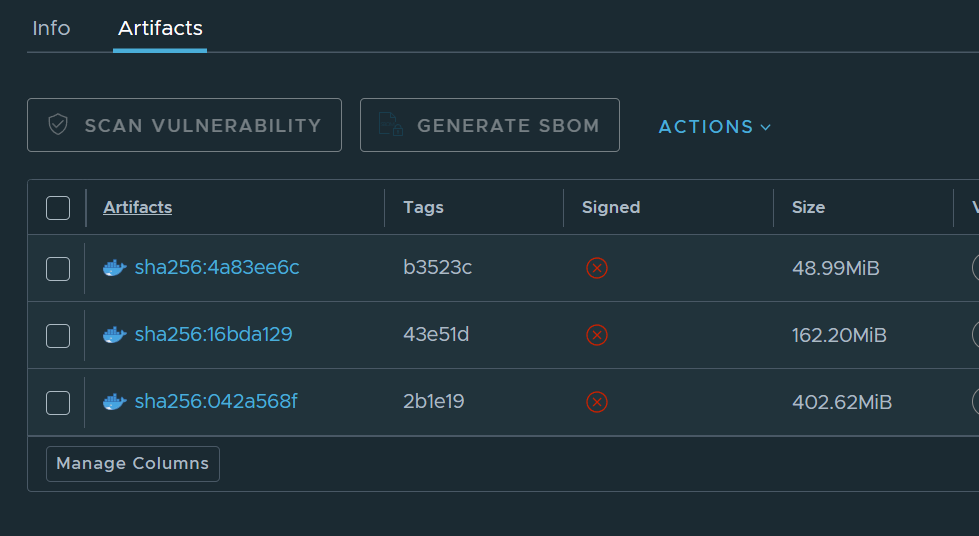

# 이미지 최적화하기

새로운 스터디를 오픈하면서 gitbook (hongit) 을 이용한 정적포스팅을 준비했습니다.

사실 Dockerfile을 준비하면서, 이미지가 상상이상으로 무거운것을 확인했습니다.

이는 배포 속도와 자원 소비에 직접적인 영향을 미칠 수 있어, 이미지 경량화가 필요했습니다. 

이에 따라 최적화를 통해 이미지를 점진적으로 줄이는 과정을 공유합니다.

---

## 최초

가장 기본적인 Node.js 이미지를 사용하여 테스트를 진행했습니다.

```
# Node.js 최신 LTS 버전인 18 버전을 사용합니다.
FROM node:18

# 작업 디렉토리를 설정합니다.
WORKDIR /app

# HonKit을 글로벌로 설치합니다.
RUN npm install -g honkit

# 현재 디렉토리의 내용을 컨테이너로 복사합니다.
COPY . /app

# 포트 설정
EXPOSE 4000

# GitBook을 빌드하고 서버를 실행합니다.
CMD ["honkit", "serve"]
```

이 구성으로 이미지를 빌드한 결과, 크기는 **402.62MiB**에 달했습니다. 이는 최적화가 필요하다는 신호였습니다.

---

## Alpine 이미지 이용

Docker에서는 경량화된 이미지인 Alpine을 제공하며, 이를 기반으로 이미지를 최적화했습니다.

```
# Node.js 최신 LTS 버전의 가벼운 Alpine 이미지를 사용합니다.
FROM node:18-alpine

# 작업 디렉토리를 설정합니다.
WORKDIR /app

# 빌드 필수 도구 설치 (필요시)
RUN apk add --no-cache python3 make g++

# HonKit을 글로벌로 설치합니다.
RUN npm install -g honkit

# 현재 디렉토리의 내용을 컨테이너로 복사합니다.
COPY . .

# 포트 설정
EXPOSE 4000

# GitBook을 빌드하고 서버를 실행합니다.
CMD ["honkit", "serve"]
```

Alpine 이미지를 사용하면서 크기가 **162.20MiB**로 줄어들었지만, 빌드 도구가 포함되어 있어 여전히 최적화 여지가 남아 있었습니다.

---

## 최종

다단계 빌드를 도입하여 빌드 과정과 실행 환경을 분리하고, 최종 실행 환경에는 필요한 빌드 산출물만 포함했습니다.

```
# 1단계: 빌드 스테이지
FROM node:18-alpine AS builder

WORKDIR /app

# 필요한 의존성 설치
RUN apk add --no-cache python3 make g++

# HonKit 설치
RUN npm install -g honkit

# 프로젝트 소스 복사
COPY . .

# HonKit 빌드
RUN honkit build

# 2단계: 최종 실행 스테이지
FROM node:18-alpine

WORKDIR /app

# 빌드 결과물만 복사
COPY --from=builder /app/_book /app/_book

# 정적 파일 제공에 필요한 serve 설치
RUN npm install -g serve

# 포트 설정
EXPOSE 4000

# 정적 파일 제공
CMD ["npx", "serve", "/app/_book"]
```

이렇게 최적화한 결과, 최종 이미지 크기는 **48.99MiB**로 줄어들었습니다. 이는 초기 이미지 대비 약 88% 크기 감소를 이룬 결과입니다.

---

## 이미지 크기 변화

최적화 과정을 거치면서 이미지 크기 변화는 다음과 같습니다:



1. **최초**: 402.62MiB
2. **Alpine 이미지 이용**: 162.20MiB
3. **MultiStage 빌드 적용**: 48.99MiB
