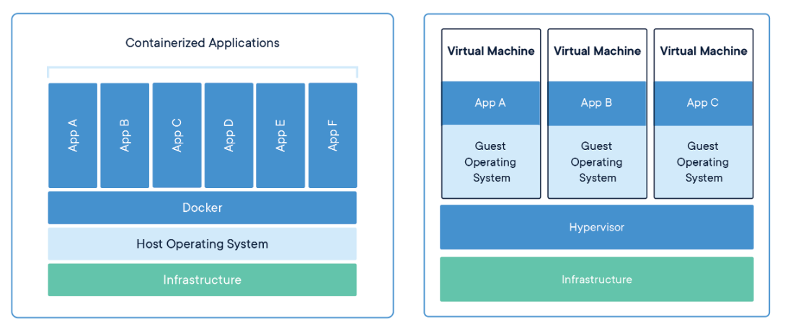
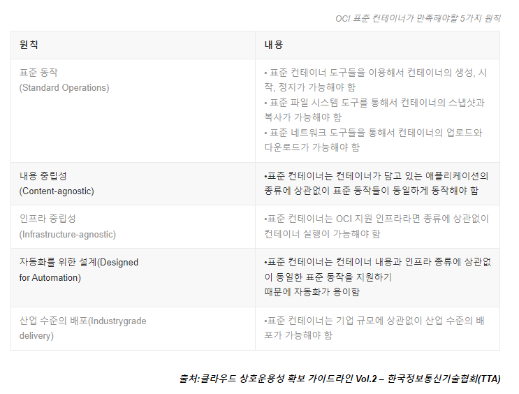

# Container

# VM과 컨테이너

### VM

**가상 머신** (  VM)은 하나의 서버를 여러 서버로 바꾸는 물리적 하드웨어의 추상화입니다.

프로그램을 실행하고 앱을 배포하기 위해 물리적 컴퓨터 대신 소프트웨어를 사용하는 컴퓨팅 리소스입니다. 하나 이상의 가상 "게스트" 머신이 물리적 "호스트" 머신에서 실행됩니다.

**하이퍼바이저 유형**

|  | **1형 하이퍼바이저** | **2형 하이퍼바이저** |
| --- | --- | --- |
| AKA | 베어메탈 하이퍼바이저. | 호스트형 하이퍼바이저. |
| 실행 환경 | 기본 물리적 호스트 머신 하드웨어. | 기본 운영 체제(호스트 OS) |
| 전용 리소스를 조정 | 예. | 아니요. |
| 예시 | VMware ESXi, Microsoft Hyper-V, KVM. | Oracle VM VirtualBox, VMware Workstation, Microsoft Virtual PC. |

### 컨테이너

컨테이너는 코드와 종속성을 함께 패키징하는 앱 계층의 추상화입니다. 

여러 컨테이너가 동일한 머신에서 실행되고 다른 컨테이너와 OS 커널을 공유할 수 있으며, 각각은 사용자 공간에서 격리된 프로세스로 실행됩니다. 

컨테이너는 VM보다 공간을 적게 차지하고(컨테이너 이미지는 일반적으로 수십 MB 크기임), 더 많은 애플리케이션을 처리할 수 있으며 더 적은 VM과 운영 체제가 필요합니다.

[https://www.docker.com/resources/what-container/](https://www.docker.com/resources/what-container/)

- Kernel namespaces (ipc, uts, mount, pid, network and user)
- Apparmor and SELinux profiles
- Seccomp policies
- Chroots (using pivot_root)
- Kernel capabilities
- CGroups (control groups)

다양한 격리들을 통해 호스트의 커널을 공유하면서도, 자원 자체의 격리나 보안을 구현하는 방식으로 설계

레이어가 적어, 오버헤드가 적은만큼 속도와 자원에서의 이점

### VM과 컨테이너 비교

| 구분 | VM(가상 머신) | 컨테이너 |
| --- | --- | --- |
| 부팅 속도 | 별도의 게스트 OS 부팅 필요로 인해 느림 | 호스트 OS 커널 공유로 즉각적인 애플리케이션 기동 가능 |
| 자원 활용 효율성 | 각 VM마다 OS 이미지를 포함해 비교적 무거움(일반적으로 수 GB 단위) | 공통 커널 사용으로 경량, 수십 MB 수준의 이미지로 자원 활용 효율적 |
| 보안 및 격리 | 하이퍼바이저를 통한 하드웨어 레벨 격리로 높은 격리 보장 | 커널 네임스페이스, cgroups 등을 통한 프로세스 레벨 격리, 상대적으로 낮은 격리 수준 |
| 사용 사례 | 독립적인 OS 환경이 필요한 경우나 레거시 애플리케이션 지원에 유리 | 마이크로서비스, CI/CD 파이프라인 등 빠른 배포와 스케일링이 필요한 모던 애플리케이션에 유리 |

## **리눅스 컨테이너(LXC)와 도커(Docker) 등장**:

)](images/image1.png)

[https://en.wikipedia.org/wiki/Docker_(software)](https://en.wikipedia.org/wiki/Docker_(software))

- 리눅스 커널 기반의 `cgroup`과 `namespace` 기술을 활용한 프로세스 격리 등장(LXC).
- Docker는 단순한 런타임뿐 아니라 이미지 빌드, 레지스트리 관리까지 포함한 올인원 솔루션으로 컨테이너 생태계 대중화.
- 이 시기에 “이미지를 어떻게 표준화할 것인가”, “컨테이너를 어떻게 표준 인터페이스로 실행할 것인가”에 대한 요구 증가.

## **OCI(Open Container Initiative) 표준화**

](images/image2.png)

[https://naleejang.tistory.com/228](https://naleejang.tistory.com/228)

- Docker 독자 규격에서 벗어나 **OCI 이미지 스펙 및 런타임 스펙**이 등장.

- 이를 통해 `containerd`, `CRI-O` 등 다양한 런타임이 표준 인터페이스를 기반으로 상호호환성을 확보.

- OCI github : [https://github.com/opencontainers](https://github.com/opencontainers)
- image-spec : [https://github.com/opencontainers/image-spec/blob/main/spec.md](https://github.com/opencontainers/image-spec/blob/main/spec.md)
- runtime-spec : [https://github.com/opencontainers/runtime-spec/blob/master/spec.md](https://github.com/opencontainers/runtime-spec/blob/master/spec.md)
- distribution-spec : [https://github.com/opencontainers/distribution-spec/blob/main/spec.md](https://github.com/opencontainers/distribution-spec/blob/main/spec.md)

# 컨테이너 구성요소

## 컨테이너 런타임 (Container Runtime)

- **Docker**: 초기 컨테이너 기술의 대명사 역할. Image 빌드, 이미지 레지스트리, 런타임까지 올인원 제공.
- **Containerd**: Docker 런타임을 분리한 컨테이너 런타임. 경량화되고 Kubernetes CRI(Container Runtime Interface)와 호환성이 좋음.
- **CRI-O**: Kubernetes 전용으로 개발된 런타임. Open Container Initiative(OCI) 규격을 따르는 이미지 및 런타임과 쉽게 연동.

### 이미지(images/image)의 구성

- 컨테이너는 특정 애플리케이션을 실행하기 위한 패키지입니다.
- Docker 이미지는 "컨테이너를 만들기 위한 청사진"으로, 애플리케이션 실행에 필요한 코드, 라이브러리, 설정을 모두 포함합니다.
- **이미지 레이어**: 컨테이너 이미지는 여러 개의 읽기 전용 레이어로 구성, 재사용을 통해 빌드 및 배포 효율성을 극대화.
- **OCI 이미지 규격**: 컨테이너 이미지 표준 규격을 통해 Docker뿐 아니라 다양한 런타임에서 호환성 확보.

### 레이어(Layer)란?

](images/image5.png)

[https://www.springcloud.io/post/2022-02/docker-layer-spring-boot/#gsc.tab=0](https://www.springcloud.io/post/2022-02/docker-layer-spring-boot/#gsc.tab=0)

- Docker 이미지는 여러 개의 **읽기 전용 레이어**가 쌓여있는 구조입니다.
- Dockerfile에 정의된 각 명령(`FROM`, `RUN`, `COPY` 등)이 새로운 레이어를 만듭니다.
- 동일한 레이어는 캐시를 통해 재사용하므로, 빌드 시간을 단축하고 저장공간을 절약할 수 있습니다.

### 컨테이너 네트워킹과 스토리지

- **네트워크** : 호스트 네임스페이스를 활용한 격리, 가상 NIC, 브릿지 네트워크, Overlay 네트워크 등을 통한 유연한 네트워킹 제공.
- 
- **스토리지**: 컨테이너 파일 시스템은 휘발성(Ephemeral)이며, Stateful 애플리케이션을 위해 Volume 을 활용.

### 컨테이너 런타임 (Container Runtime) 개념 등장

**런타임 필요성**:

컨테이너를 실행하기 위해서는 “어떻게 프로세스를 격리하고, 네임스페이스와 cgroup을 구성하며, 이미지를 어떻게 마운트할 것인지”와 같은 구체적 동작이 필요합니다. 이를 담당하는 소프트웨어가 바로 **컨테이너 런타임**입니다.

**초기 등장 - Docker**:

- Docker는 컨테이너 이미지 빌드, 실행, 레지스트리 관리까지 올인원으로 제공함으로써 초기 컨테이너 생태계 확장에 큰 기여를 했습니다.
- 이후 성능 및 상호 운용성, 표준화 요구가 높아지며 Docker 런타임으로부터 분리된 `containerd`, Kubernetes 친화적 런타임인 `CRI-O` 등이 등장했습니다.

### 4. 컨테이너 이미지의 표준화와 OCI

**이미지 개념 등장**:

컨테이너 이미지는 “애플리케이션 실행에 필요한 모든 것을 포함한 패키지”입니다. 이 이미지를 표준화하면, 특정 런타임에 종속되지 않고도 어디에서나 실행 가능한 컨테이너를 만들 수 있습니다.

**OCI (Open Container Initiative) 규격**:

도커 초창기에는 Docker 고유 형식만 있었으나, 이후 컨테이너 생태계가 커지면서 표준 이미지 /포맷과 런타임 사양이 필요해졌습니다. 이에 OCI에서 이미지와 런타임에 대한 공개 표준을 정의, `Docker`, `containerd`, `CRI-O` 모두 이 규격에 맞추어 상호호환성 확보가 가능해졌습니다.

## 컨테이너 네트워크와 스토리지

### 네트워크 인터페이스 표준화 (CNI)

1. **초창기 네트워킹**:
    - Docker 초기에는 자체 브릿지 네트워크(docker0), 호스트 네트워크, 포트 맵핑 등 단순한 구조.
    - 컨테이너 증가에 따라 서로 다른 호스트에 분산된 컨테이너를 하나의 논리 네트워크로 묶기 위한 Overlay 네트워크, SDN, 플러그인 형태 솔루션(Flannel, Calico, Weave 등) 등장.
2. **CNI(Container Network Interface) 등장**:
    - Kubernetes와 같은 오케스트레이션 환경에서는 다양한 네트워크 솔루션을 유연하게 붙일 수 있는 공통 규격 필요.
    - CNI는 컨테이너 네트워크를 설정하고 삭제하기 위한 표준 인터페이스 정의.
    - 이를 통해 다양한 네트워크 플러그인이 공통된 방식으로 컨테이너 네트워크를 관리 가능해짐.

### 스토리지 인터페이스 표준화 (CSI)

1. **초창기 스토리지 접근**:
    - Docker 볼륨, 바인드 마운트 등 호스트 종속적이며 특정 스토리지 기술에 종속된 방식 활용.
    - 클러스터 환경, 멀티노드 환경 확대에 따라 외부 스토리지(블록, 파일, 오브젝트)와 컨테이너 간의 일관된 연동 필요성 증가.
2. **CSI(Container Storage Interface) 탄생**:
    - Kubernetes를 비롯한 컨테이너 오케스트레이션 환경에서 표준화된 스토리지 플러그인 인터페이스 필요성 대두.
    - CSI를 통해 다양한 스토리지 벤더(클라우드 EBS, Ceph, NFS, GlusterFS 등)가 공통 규격으로 컨테이너에 스토리지 제공 가능.
    - 이를 통해 특정 런타임이나 특정 플랫폼에 종속되지 않고, 다양한 스토리지를 일관성 있게 다룰 수 있게 됨.
