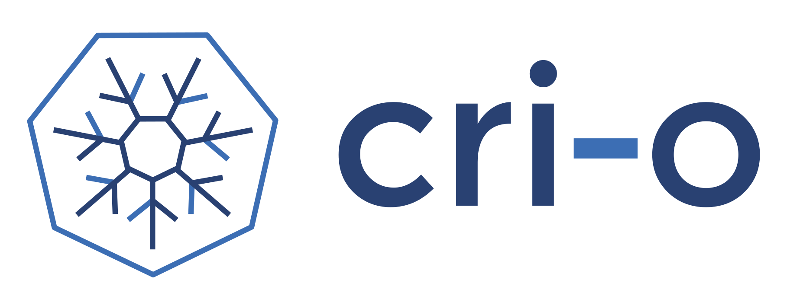
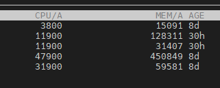

# About Kubernetes

## 쿠버네티스 소개

### 쿠버네티스(Kubernetes)란 무엇인가?

- **컨테이너 오케스트레이션 툴**: 다수의 컨테이너를 효율적으로 자동화(배포, 스케일링, 업데이트, 복구)하는 플랫폼.
- **CNCF(Could Native Computing Foundation)에서 관리하는 오픈소스 프로젝트**: 구글 내부의 Borg/Omega 시스템 경험을 바탕으로 개발.
- **클러스터 기반 아키텍처**: 여러 노드(Node)로 이루어진 클러스터에서 애플리케이션 컨테이너를 효율적으로 관리.
- **거대한 API 기반의 자동화 시스템**: 사용자는 선언적 구성(YAML 등)을 API를 통해 제출하고, 쿠버네티스는 이를 바탕으로 '원하는 상태(Desired State)'를 유지. 즉, Kubernetes API를 통해 리소스를 정의하면, 내부 컨트롤러들이 이 요청을 처리하고 클러스터 상태를 유지

## 아키텍처 개요

## 구성요소

### 컨트롤 플레인(Control Plane)

- **API 서버(kube-apiserver)**: 모든 요청이 통하는 중앙 게이트웨이. 사용자가 YAML로 정의한 리소스를 제출하면 API 서버가 이를 etcd에 반영하고 컨트롤러 및 스케줄러와 연계.
- **etcd**: 클러스터 상태 정보 저장소. 모든 리소스(파드, 서비스, 컨피그 등)의 원본 데이터가 여기 기록.
- **컨트롤러 매니저(kube-controller-manager)**: 디플로이먼트, 레플리카셋 등 다양한 컨트롤러들이 주기적으로 실제 상태를 원하는 상태로 맞추도록 동작.
- **스케줄러(kube-scheduler)**: 새 파드를 배치할 노드를 결정.

API 서버를 중심으로 상호작용하며, etcd에 기록된 상태 정보를 기반으로 지속적으로 클러스터 상태를 원하는 방향으로 조정.

### 워커 노드(Worker Nodes)

- **kubelet**: 해당 노드에 배치된 파드가 API 서버에서 정의한 상태대로 동작하도록 컨테이너 런타임(Docker, containerd 등)과 통신.
- **kube-proxy**: 서비스(로드밸런싱) 트래픽을 처리하고 파드 간 네트워크 통신을 관리.
- **컨테이너 런타임**: 파드를 구성하는 컨테이너를 실제로 구동.

워커 노드는 kubelet을 통해 API 서버에 지속적으로 상태 정보를 보고하며, 

스케줄러나 컨트롤러 매니저가 내린 결정에 따라 파드를 생성, 제거, 업데이트함.

## 주요 개념

- **파드(Pod)**: 하나 이상의 컨테이너를 묶은 최소 배포 단위. 동일한 네트워크 네임스페이스를 공유하며 함께 스케일링, 롤링 업데이트됨.
- **서비스(Service)**: 파드 집합에 대한 일관된 접근점을 제공. 파드가 동적으로 변하더라도 클라이언트는 같은 IP/엔드포인트로 접근 가능.
- **디플로이먼트(Deployment)**: 파드 템플릿과 스케일 정보 등을 선언적으로 정의한 상위 리소스. 롤링 업데이트, 롤백 등이 손쉽게 가능.
- **레플리카셋(ReplicaSet)**: 지정한 파드 개수를 항상 유지하도록 하는 리소스. 디플로이먼트 내부적으로 레플리카셋을 활용.

### 컨테이너 표준 인터페이스

### CRI(Container Runtime Interface)

- **등장 배경**: 초기에는 Docker 등 특정 런타임에 종속적이었으나, 다양한 런타임(containerd, CRI-O)을 유연하게 수용할 필요성 대두.

](images/image.png)

[https://www.samsungsds.com/kr/insights/docker.html](https://www.samsungsds.com/kr/insights/docker.html)

- **CRI 역할**: kubelet과 컨테이너 런타임을 연결하는 표준 인터페이스를 제공한다.
- **효과**: 특정 런타임에 종속되지 않고, 다양한 런타임을 쉽게 교체 및 확장할 수 있다.

### CNI(Container Network Interface)

- **등장 배경**: 초기 컨테이너 네트워킹은 Docker 자체 브릿지나 포트 매핑 정도였으나, 복잡한 멀티노드 환경에서는 SDN, Overlay 네트워크 등의 필요성이 대두되었다.
- **CNI 역할**: 다양한 네트워크 플러그인(Flannel, Calico, Weave 등)이 표준화된 방식으로 컨테이너 네트워크를 설정/삭제할 수 있도록 하는 인터페이스.
- **효과**: 특정 오케스트레이션 툴에 종속되지 않고, 유연한 네트워크 구성을 가능하게 한다.

### CSI(Container Storage Interface)

- **등장 배경**: 컨테이너 환경에서 다양한 스토리지(클라우드 EBS, NFS, Ceph 등)를 일관된 방식으로 다루기 위한 표준 필요.
- **CSI 역할**: 컨테이너 오케스트레이션 시스템에서 표준화된 스토리지 플러그인 인터페이스를 제공하여, 특정 벤더나 기술에 종속되지 않는 스토리지 관리 가능.
- **효과**: 쿠버네티스에서 다양한 외부 스토리지를 유연하게 활용할 수 있으며, 지속 가능한 스토리지 확장성을 확보한다.

### 쿠버네티스의 이점

- 자원 통합 : 컨테이너, 네트워킹, 스토리지, 보안, 설정 관리, 노드 자원 등을 API로 추상화
    
    
    
- **선언적 배포(Declarative Deployment)**: 원하는 상태(Desired State)를 YAML 등으로 정의하면, 쿠버네티스가 이를 만족하도록 자동 조정.
- **자동화된 스케일링(Auto Scaling)**: CPU, 메모리 사용량 기반의 Horizontal Pod Autoscaler를 통해 자원 사용량에 따라 파드를 자동으로 증가(Horizontal Pod Autoscaler) 또는 감소.
- **자체 치유(Self-Healing)**: 비정상 파드 자동 재시작, 노드 장애시 파드 재스케줄링, 헬스 체크(Health Check)로 인한 자동 롤링 업데이트 및 롤백 기능으로 애플리케이션 가용성을 극대화.

- **보안 및 인증/인가 강화**
    - Role-Based Access Control(RBAC), Network Policies, Admission Controller, Pod Security Standards 등 다층적인 보안 정책 적용.
    - TLS 기반 API 서버 접근, 서비스 계정(ServiceAccount), 비밀 정보(Secrets) 관리, Vault 연동 등을 통해 민감 정보나 접근 권한을 철저히 관리할 수 있음.
    - **역할 기반 접근 제어(RBAC, Role-Based Access Control)**
        - 쿠버네티스 API 접근을 특정 사용자나 서비스 계정이 어떤 리소스에 대해 어떤 동작(읽기, 쓰기, 업데이트 등)을 할 수 있는지 명확히 정의 가능.
    - **네임스페이스(Namespace)**
        - 쿠버네티스 클러스터 내 리소스들을 논리적으로 격리하기 위한 이름공간.
        - 애플리케이션, 팀, 환경(개발/스테이징/프로덕션)별로 네임스페이스를 분리함으로써 리소스 충돌을 방지하고, 접근 제어나 할당 자원 관리에도 유용.
        - RBAC나 네트워크 정책, 리소스 쿼터(Quota) 등을 네임스페이스 단위로 적용할 수 있어, 체계적인 멀티테넌트(Multi-Tenant) 환경 구축에 기여.
    - **네트워크 정책(Network Policy)**
        - 파드(Pod) 수준의 네트워크 트래픽 흐름을 제어하는 규칙 세트.
    - **정책 엔진(Admission Controller)**
        - 쿠버네티스 API 서버로 들어오는 요청을 사전 검증/변환/거부하기 위한 플러그인 구조체.
            - **Validating Admission Controller**: 리소스가 특정 규칙에 맞는지 확인하고, 위배 시 요청 거부.
            - **Mutating Admission Controller**: 리소스를 동적으로 변환(레이블 추가, sidecar 삽입 등).
        - **AppArmor, Linux Capabilities 등 호스트 수준 보안 강화**
        - **AppArmor**: 파드 내 컨테이너 프로세스에 대해 추가적인 보안 프로파일을 적용해 파일 접근, 네트워크 사용 등을 제한.
        - **Linux Capabilities**: 컨테이너 런타임 수준에서 필요한 최소한의 권한만 할당해, 불필요한 루트 권한이나 시스템 콜 사용을 억제.

- **커스텀 리소스(CR) 기반 확장**
    - CRD를 통해 쿠버네티스 API를 확장하여 조직만의 맞춤형 리소스를 정의하고, 이를 오퍼레이터 패턴(Operator Pattern)으로 자동 관리.
    - CPU, 메모리 외에도 HugePage나 GPU, FPGA 같은 특수 하드웨어 리소스를 Device Plugin을 통해 노출하고 관리 가능.
    - 이를 통해 쿠버네티스는 단순 컨테이너 오케스트레이션을 넘어, 다양한 워크로드(데이터베이스, 머신러닝, 고성능 연산 등)에 최적화된 플랫폼으로 발전할 수 있음.

- **다양한 오픈소스 생태계 및 확장성**
    - Helm을 통한 패키지 관리로 복잡한 애플리케이션 스택을 쉽게 배포하고 업그레이드 가능.
    - CNI(Container Network Interface), CSI(Container Storage Interface) 같은 표준 인터페이스 덕분에 다양한 네트워크 및 스토리지 플러그인을 손쉽게 연동할 수 있으며, ISTIO와 같은 서비스 메쉬(Service Mesh)나 Calico, Cilium 등의 네트워크 플러그인을 통해 고도의 네트워킹 정책 구현 가능.
    - KEDA, Argo CD, Prometheus, Vault 등 수많은 CNCF 및 오픈소스 프로젝트와 자연스럽게 연계되어 DevOps, Observability, 보안 강화, Secret 관리 등 다양한 운영 영역을 확장 가능.

](images/image2.png)

[https://landscape.cncf.io/](https://landscape.cncf.io/)